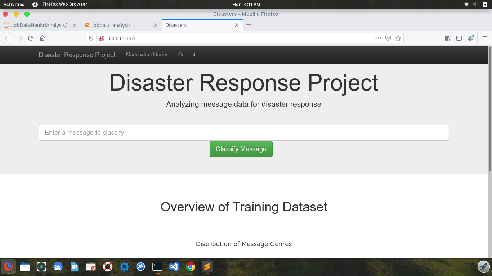
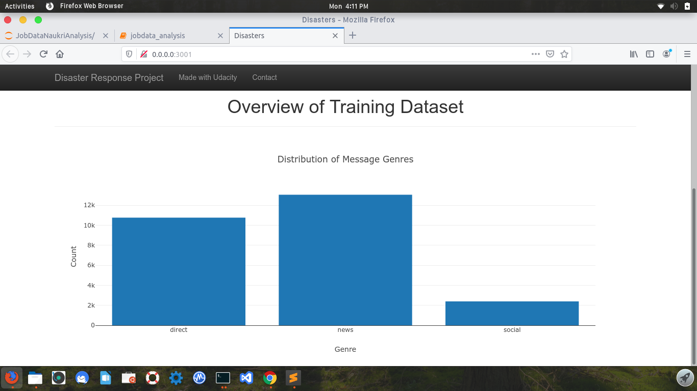
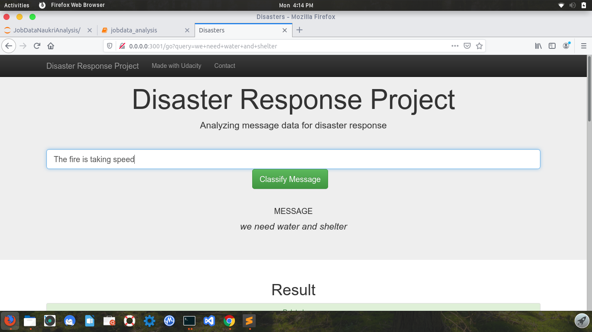
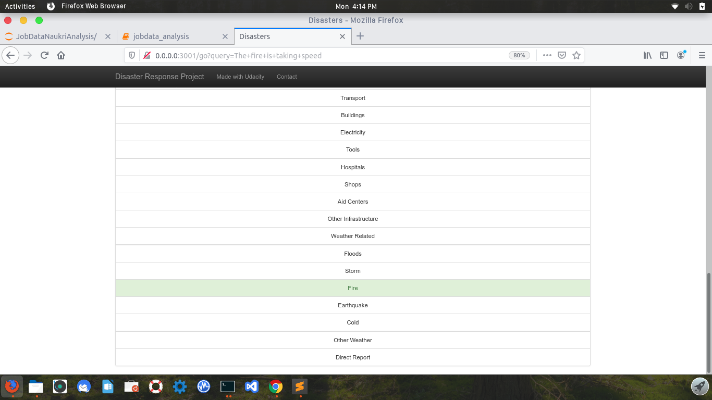

# Disaster Response

This project helps categorizing any message against thirty six categories to check whether or not it is relevant to disaster response professionals. 



## Installation

### Download

You can download or clone the Git repository at:
```
git clone https://github.com/RajibDas-123/Disaster_Response
```
### Execute

1. Run the following commands in the project's root directory to set up your database and model.

    - To run ETL pipeline that cleans data and stores in database
        `python data/process_data.py data/messages.csv data/categories.csv data/DisasterResponse.db`
    - To run ML pipeline that trains classifier and saves
        `python models/train_classifier.py data/DisasterResponse.db models/classifier.pkl`

2. Run the following command in the app's directory to run your web app.
    `python run.py`

3. Go to http://0.0.0.0:3001/


## Usage example

After you run the program and open the url, you will see the landing page like shown at the top.


If you scroll down you will see a visualization of the training data set.




You can type your message in the input field as shown below.




On clicking **Classify Message**, you can see the categories that the message belongs to highlighted in green. Like this



## Development setup

You need to have following dependencies installed in your system in order to run this application.

* Python 3.5+ 
* Machine Learning Libraries: NumPy, SciPy, Pandas, Sciki-Learn
* Natural Language Process Libraries: NLTK
* SQLlite Database Libraqries: SQLalchemy
* Web App and Data Visualization: Flask, Plotly


## Meta
### Authors

* [Rajib Das](https://github.com/RajibDas-123)

### Acknowledgements

* [Udacity](https://www.udacity.com/) for providing such a complete Data Science Nanodegree Program
* [Figure Eight](https://www.figure-eight.com/) for providing messages dataset to train my model

## Contributing

1. Fork it (<https://github.com/RajibDas-123/Disaster_Response/fork>)
2. Create your feature branch (`git checkout -b feature/fooBar`)
3. Commit your changes (`git commit -am 'Add some fooBar'`)
4. Push to the branch (`git push origin feature/fooBar`)
5. Create a new Pull Request
